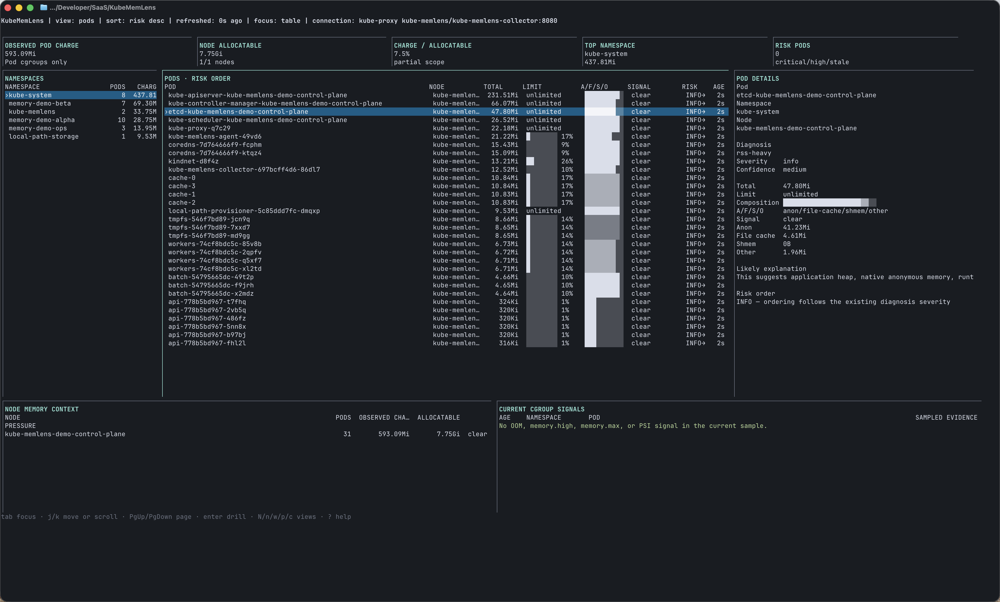

# KubeMemLens

KubeMemLens is a terminal-first Kubernetes memory inspector.

It helps answer:

> Why is this pod's memory high?

Instead of showing one scary memory number, KubeMemLens partitions pod/container memory into anonymous memory, filesystem-backed cache, tmpfs/shared memory, and residual/other, then adds explicitly overlapping kernel, writeback, and pressure drill-down evidence.

The goal is to make incidents like "kubectl top says memory is high, but the app heap is stable" easier to understand.

## Status

KubeMemLens is in alpha. `v0.0.1-alpha.3` is intended for evaluation on disposable or explicitly authorised clusters and does not carry a production stability or support guarantee. The current alpha is not suitable for shared multi-tenant clusters because collector reads and agent writes do not yet have the required application-level authentication and authorisation boundary. The sample CLI works without Kubernetes, and the Helm chart deploys a Linux node-local agent plus an in-memory collector for real cgroup snapshots. The CLI queries the collector through the Kubernetes API service proxy by default, with HTTP/port-forward mode as a fallback. The collector also exposes conservative Prometheus/OpenMetrics metrics at `/metrics`.

The full lifecycle path has passed locally on the current upstream-supported Kubernetes 1.34, 1.35 and 1.36 minors. Managed-provider qualification is still in progress. GKE, EKS, AKS, CRI-O and other provider/runtime profiles remain unclaimed until the planned matrix completes and its reviewed evidence is published.

## Install the alpha

Use the exact alpha version. Review the [installation guide](docs/installation.md), [support and compatibility contract](docs/compatibility.md), and [release assets](https://github.com/danushkastanley/KubeMemLens/releases) before installing it.

```sh
helm upgrade --install kube-memlens \
  oci://ghcr.io/danushkastanley/charts/kube-memlens \
  --version 0.0.1-alpha.3 \
  --namespace kube-memlens \
  --create-namespace
```

The chart uses the version-aligned release image by default. Qualification and policy-controlled installs should pin the image digest recorded in `release-subjects.txt`.

## TUI 2.0



The terminal interface is an incident-focused memory cockpit rather than a generic Kubernetes browser. Its current workflow includes:

- responsive compact, standard and wide layouts, with a usable 80×24 minimum and a master-detail dashboard from 150×30;
- virtualised tables and detail views with stable selection across refresh, sorting and filtering;
- first-class node, namespace, workload, Pod and container navigation;
- risk-oriented Pod ordering plus structured severity, diagnosis, pressure, owner and freshness filters;
- non-overlapping anonymous/file-cache/shmem/other composition bars, limit/headroom gauges, live trends and sampled OOM, `memory.high`, `memory.max` and PSI signals;
- bounded, race-safe selected-Pod history that retains the last good series through a refresh error;
- read-only recommendations, live Pod comparison, safe command copy and mode-`0600` redacted incident capture; and
- Kubernetes API service-proxy connectivity by default, with no port-forward required for normal use.

The summary deliberately says **observed Pod charge**: it is the sum of mapped Pod cgroups, not total cluster or node memory usage. Colours reinforce text labels but are not required; set `NO_COLOR=1` for monochrome output.

## Example

```sh
go run ./cmd/kubectl-memlens sample explain cache-heavy
```

```text
Sample: cache-heavy

Total charged memory: 4.10 GiB
RSS / anon:           1.20 GiB
File cache:           2.51 GiB
Active file:          2.20 GiB
Inactive file:        380.00 MiB
Shmem / tmpfs:        90.00 MiB
Slab:                 140.00 MiB
Other kernel:         40.00 MiB
Dirty/writeback:      low

Diagnosis:
cache-heavy
Severity: info
Confidence: medium
```

```sh
go run ./cmd/kubectl-memlens sample top
go run ./cmd/kubectl-memlens version
```

## Development

```sh
go test ./...
go run ./cmd/kubectl-memlens sample list
go run ./cmd/kubectl-memlens sample explain cache-heavy
go run ./cmd/kubectl-memlens sample top
```

Make targets are available:

```sh
make test
make coverage
make build
make run-sample-top
make run-sample-explain
make fmt
make vet
make vuln
make check
make qualify-cluster # requires the explicit environment in docs/qualification.md
```

## Cluster Smoke Test

Start minikube with Docker:

```sh
minikube start --driver=docker --cpus=2 --memory=4096
```

Build and load a local image:

```sh
docker build -t kube-memlens:local-smoke .
minikube image load kube-memlens:local-smoke
```

Deploy the chart:

```sh
helm upgrade --install kube-memlens ./charts/kube-memlens \
  -n kube-memlens \
  --create-namespace \
  --set image.repository=kube-memlens \
  --set image.tag=local-smoke \
  --set image.pullPolicy=Never
```

When iterating quickly, use a fresh image tag or restart the workloads after `minikube image load` so the cluster does not keep an older local image.

Inspect the workloads:

```sh
kubectl get all -n kube-memlens
kubectl logs -n kube-memlens ds/kube-memlens-agent
kubectl logs -n kube-memlens deploy/kube-memlens-collector
```

Run a one-shot agent scan:

```sh
kubectl exec -n kube-memlens ds/kube-memlens-agent -- /memlens-agent --cgroup-root=/host/sys/fs/cgroup --once
```

Query the collector directly, if you want to inspect the HTTP API:

```sh
kubectl -n kube-memlens port-forward svc/kube-memlens-collector 18080:8080
curl http://127.0.0.1:18080/healthz
curl http://127.0.0.1:18080/api/v1/debug/store
curl http://127.0.0.1:18080/api/v1/pods
curl http://127.0.0.1:18080/api/v1/history/pods/kube-memlens/<pod-name>
curl http://127.0.0.1:18080/metrics
```

Use the CLI against collector snapshots without a manual port-forward:

```sh
go run ./cmd/kubectl-memlens status
go run ./cmd/kubectl-memlens doctor
go run ./cmd/kubectl-memlens top pods -A
go run ./cmd/kubectl-memlens top containers -A
go run ./cmd/kubectl-memlens top workloads -A
go run ./cmd/kubectl-memlens top ns
go run ./cmd/kubectl-memlens explain pod <pod-name> -n <namespace>
go run ./cmd/kubectl-memlens explain workload deployment/<name> -n <namespace>
go run ./cmd/kubectl-memlens history pod <pod-name> -n <namespace>
go run ./cmd/kubectl-memlens capture -n <namespace> --pod <pod-name> --include-history -o incident.json
go run ./cmd/kubectl-memlens replay incident.json --pod <namespace>/<pod-name>
go run ./cmd/kubectl-memlens compare pod/<first> pod/<second> -n <namespace>
go run ./cmd/kubectl-memlens compare --before before.json --after after.json --pod <namespace>/<pod-name>
go run ./cmd/kubectl-memlens compare --before before.json --after after.json --workload <namespace>/<kind>/<name>
```

`top pods`, `top containers`, and `top workloads` accept Kubernetes Pod label selectors with `-l`, safe field selectors, `--sort-by`, `--no-headers`, and `-o table|json|yaml|csv`. Add `--watch` for a two-second terminal refresh, or set a bounded interval with `--watch-interval`.

Pod and workload explanations show investigation severity, independent confidence, caveats, and exact gauge/counter evidence windows. They support a versioned, privacy-restrained machine contract through `-o json|yaml`; see [the schema](docs/explanation-schema.md). An optional read-only [K9s plugin](docs/k9s-integration.md) opens the selected Pod explanation with `Shift-M`.

Read-only composition-aware guidance is exportable with `kubectl memlens recommend pod <name> -n <namespace> -o text|json|yaml` or the corresponding `workload` command. Recommendations include rationale and guard conditions and never mutate resources.

## Using Without Port-Forward

By default, KubeMemLens uses the Kubernetes API service proxy to reach the in-cluster collector. The default collector target is:

- namespace: `kube-memlens`
- service: `kube-memlens-collector`
- port: `8080`

```sh
go run ./cmd/kubectl-memlens status
go run ./cmd/kubectl-memlens doctor
go run ./cmd/kubectl-memlens top pods -A
go run ./cmd/kubectl-memlens tui
```

Override the collector target when needed:

```sh
go run ./cmd/kubectl-memlens status \
  --collector-namespace=kube-memlens \
  --collector-service=kube-memlens-collector \
  --collector-port=8080
```

Use a specific kubeconfig or context:

```sh
go run ./cmd/kubectl-memlens top pods -A --kubeconfig=/path/to/config --context=minikube
```

## Fallback To Port-Forward

HTTP mode is still supported for local debugging or restricted RBAC environments:

```sh
kubectl -n kube-memlens port-forward svc/kube-memlens-collector 18080:8080
go run ./cmd/kubectl-memlens top pods -A --collector-url=http://127.0.0.1:18080
go run ./cmd/kubectl-memlens top containers -A --collector-url=http://127.0.0.1:18080
go run ./cmd/kubectl-memlens top ns --collector-url=http://127.0.0.1:18080
go run ./cmd/kubectl-memlens explain pod <pod-name> -n <namespace> --collector-url=http://127.0.0.1:18080
```

## Terminal Dashboard

Run a preflight when installation, freshness, or mapping looks wrong:

```sh
kubectl memlens doctor
kubectl memlens doctor --output=json
kubectl memlens doctor --strict
```

`doctor` checks build identity, collector connectivity, reporting agent nodes, snapshot freshness, cgroup/runtime access, Node MemoryPressure context, mapping coverage, and store consistency. Warnings are informational by default; `--strict` makes them fail for automation.

Run the dashboard:

```sh
go run ./cmd/kubectl-memlens tui
```

Future installed usage:

```sh
kubectl memlens tui
```

At 80×24, the Pod table keeps the incident fields visible and makes every detail line reachable by keyboard:

```text
KubeMemLens | view: pods | sort: risk desc | refreshed: 2s ago

POD                  TOTAL    LIMIT             A/F/S/O       RISK   AGE
›payments/api-0      812Mi    ███████░ 79%      ███▓▓▒░░      HIGH↑  3d
 payments/worker-0   643Mi    █████░░░ 63%      ██▓▓▓░░░      MED→   5h

q quit · space pause · r refresh · / filter · N/n/w/p/c views · enter drill
```

At 150 columns and 30 rows or larger, the Pod view becomes a dense master-detail dashboard. It adds an observed-Pod-charge summary strip, namespace context, the risk-ordered Pod table, selected Pod evidence, node memory context and current sampled cgroup signals. “Observed Pod charge” is the sum of mapped Pod cgroups; it is not total cluster or node memory usage. Node allocatable memory is context, and the displayed charge/allocatable percentage is explicitly partial-scope.

The primary `A/F/S/O` bar partitions charged memory into anonymous, filesystem cache excluding shmem, shmem/tmpfs and residual/other. Limit gauges say `unknown` or `unlimited` when a percentage would be misleading. OOM, `memory.high`, `memory.max` and PSI labels describe the current cgroup sample or counter-delta window; they are not Kubernetes eviction events. Colours reinforce text labels but are not required. Set `NO_COLOR=1` for monochrome output.

Key controls:

| Key | Behaviour |
|---|---|
| `j`/`k`, arrows, Page Up/Page Down, `g`/`G` | Move within the visible table or detail viewport |
| `N`, `n`, `w`, `p`, `c` | Open node, namespace, workload, Pod or container views |
| `Enter` or `e` | Drill into the selected entity or open its explanation |
| `h`, Backspace or Escape | Return or clear the active filter |
| `/` | Filter the current view; Pod filters also accept `severity:`, `diagnosis:`, `pressure:`, `owner:` and `state:` tokens |
| `s` | Cycle risk, total, RSS, cache, shmem and name sorting |
| Space / `r` | Pause automatic refresh / refresh manually; manual refresh remains available while paused |
| Tab | At wide sizes, move focus between the table and selected detail; it no longer changes entity view |
| `a`, `R`, `x`, `C`, `y` | Open incident actions, recommendations, compare, redacted capture or copy a safe command |
| `?` / `q` | Show help / quit and restore the terminal |

Recommendations and comparisons are read-only. TUI capture uses the same redaction and private-file rules as the CLI, refuses overwrite without confirmation and never applies a resource change. Deep memory evidence requires the standard cgroup v2 agent path and history remains bounded and in memory. Container detail can show the parent Pod's bounded history; KubeMemLens does not claim container-level historical attribution.

## Prometheus / OpenMetrics Export

The collector exposes scrapeable metrics at:

```text
/metrics
```

By default, namespace and pod metrics are enabled. Container metrics are disabled by default because they can create high-cardinality series in busy clusters.

Enable container metrics only when the series count is acceptable:

```sh
helm upgrade --install kube-memlens ./charts/kube-memlens \
  -n kube-memlens \
  --set metrics.includeContainers=true
```

Port-forward smoke test:

```sh
kubectl -n kube-memlens port-forward svc/kube-memlens-collector 18080:8080
curl -s http://127.0.0.1:18080/metrics | head -40
```

Kubernetes API service proxy smoke test:

```sh
kubectl get --raw '/api/v1/namespaces/kube-memlens/services/http:kube-memlens-collector:8080/proxy/metrics' | head
```

If that service proxy form does not work in your cluster, try:

```sh
kubectl get --raw '/api/v1/namespaces/kube-memlens/services/kube-memlens-collector:8080/proxy/metrics' | head
```

PromQL examples:

```promql
topk(10, sum by (namespace) (kubememlens_namespace_memory_bytes{type="total"}))
```

```promql
(
  kubememlens_namespace_memory_bytes{type="file_cache"}
  /
  kubememlens_namespace_memory_bytes{type="total"}
) > 0.4
```

```promql
topk(20, kubememlens_pod_memory_bytes{type="anon"})
topk(20, kubememlens_pod_memory_bytes{type="file_cache"})
kubememlens_pod_diagnosis{diagnosis="cache-heavy"} == 1
kubememlens_pod_diagnosis{diagnosis="oom-risk"} == 1
```

See `docs/metrics.md` for the metric list, labels, guardrails, Helm values, and PromQL examples.

See [installation and upgrade](docs/installation.md), the [support and compatibility contract](docs/compatibility.md), and the [release process](docs/release-process.md) for the current distribution contract and unverified environments.

## RBAC For Kube-Proxy Mode

The kubeconfig identity running the CLI needs permission to access the collector service proxy:

```sh
kubectl auth can-i get services/proxy -n kube-memlens
```

See `examples/rbac/kube-memlens-viewer.yaml` for a minimal Role that an admin can bind to users or groups.

## Current Scope

- cgroup v2 parsing for composition, peak, boundaries, PSI, swap, hierarchical/local events, and reclaim counters
- cgroup walker for Kubernetes container cgroups
- memory model with clear buckets
- explanation engine for common high-memory profiles
- Cobra-based CLI skeleton
- sample data for local development
- node-local agent that maps cgroups to pod/container metadata
- Pod context for requests, limits, QoS, restarts, recent termination state, phase, creation time, runtime class, memory-backed `emptyDir`, node allocatable memory, direct owner, and top-level workload
- agent to collector snapshot POST
- in-memory collector with Pod/namespace aggregation and explicit node, container, response-byte, history, and metrics ceilings
- bounded in-memory Pod history for composition, swap, PSI, peak, and memory-event deltas
- collector-backed `top pods`, `top containers`, `top workloads`, `top ns`, `explain pod`, and `explain workload`
- K9s-style Bubble Tea workflow with namespace, workload, Pod, container, bounded trend, and evidence detail views
- Kubernetes API service proxy mode for CLI/TUI collector access
- `status` command for collector connectivity and latest snapshot counts
- `doctor` checks for node freshness, cgroup v2, runtime layout, cgroup read errors, mapping, and store consistency
- Prometheus/OpenMetrics `/metrics` endpoint with cardinality guardrails

## Non-Goals

- No web dashboard
- No eBPF attribution yet
- No persistent or long-term storage
- No SaaS or external telemetry
- No auto-remediation
- No CRDs
- No automatic port-forwarding

## Security Posture

The alpha release reads cgroup files through a read-only `/sys/fs/cgroup` hostPath mount and reads Pod metadata through the Kubernetes API. CLI kube-proxy mode uses the user's Kubernetes credentials and is governed by RBAC, but permission to proxy the collector does not provide namespace-scoped authorisation inside the collector. Metrics are exposed only by the in-cluster collector service by default. KubeMemLens does not send telemetry, phone home, or persist workload data outside the in-memory collector. The [support contract](docs/compatibility.md) records the v1 tenant boundary, exposed metadata and unsupported environments. Optional eBPF tracing remains deferred behind a separate [design](docs/ebpf/OPTIONAL_EBPF_DESIGN.md), [multi-tenant threat model](docs/security/KubeMemLens-threat-model.md), [benchmark protocol](docs/ebpf/BENCHMARK_PROTOCOL.md), and independent security review.

## Contributing

Small, focused issues and pull requests are welcome. Please keep language incident-friendly, avoid overclaiming root cause, and add tests when behaviour changes.

False or ambiguous explanations have a dedicated issue form and [privacy-preserving community feedback process](docs/community-feedback.md); KubeMemLens does not collect product telemetry. Compatibility claims require reviewed evidence from the [qualification process](docs/qualification.md).
