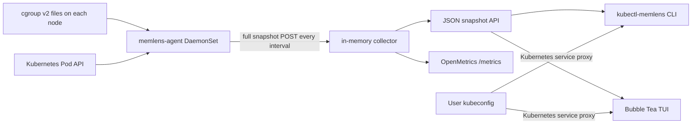

# KubeMemLens: Codebase, Ecosystem, and Open-Source Product Research

Research date: 18 July 2026

## Executive decision

KubeMemLens has a credible open-source product core, but its strongest opportunity is not to become another general Kubernetes dashboard, metrics exporter, or rightsizing tool.

The defensible product is:

> A privacy-first, terminal-native Kubernetes memory incident explainer that correlates raw cgroup v2 memory composition and pressure with Kubernetes workload context, then tells an operator what the evidence means and what to check next.

That is materially more focused than K9s or Pixie, more diagnostic than `kubectl top`, and complementary to cAdvisor, Prometheus, Goldilocks, and KRR.

The current repository is a good v0.x prototype. It is not ready for a public community release yet. The next work should first correct memory semantics, bound and secure the collector, harden runtime compatibility, and establish reproducible releases. Feature expansion should then centre on pressure and event deltas, Kubernetes context, short incident history, workload roll-ups, and portable incident snapshots. Optional eBPF should remain a later, explicitly enabled extension.

## Research method and verified state

This report is based on:

- All 92 project files currently present in the repository, including the uncommitted v0.5 metrics and Helm work.
- The README, architecture, memory semantics, metrics, security model, roadmap, Helm chart, API types, cgroup parser and walker, Kubernetes mapper, agent, collector, clients, CLI, TUI, explanation engine, and tests.
- Local verification on 18 July 2026:
  - `go test ./...` passed.
  - `go test -race ./...` passed.
  - `go vet ./...` passed.
  - All three Go binaries built.
  - The cache-heavy explanation and sample top runtime paths passed.
  - The container image built successfully and runs as UID/GID `65532:65532`; its local size was approximately 25.2 MB.
  - Aggregate statement coverage was 36.7%.
  - `govulncheck` found two reachable vulnerabilities through the agent HTTP path: `GO-2026-5026` and `GO-2026-4918`, both from `golang.org/x/net` v0.38.0.
  - Helm lint, template, and cluster smoke tests were not run because Helm is not installed and no local cluster was running.

No implementation files were changed during this research.

## Current architecture

The architecture is small and understandable. The model, parser, explanation engine, collector, clients, CLI, and TUI are separated cleanly. Hand-written Go files remain within the global size limits, and the implementation favours explicit code over framework-heavy abstraction.

### Capabilities already present

| Area | Current behaviour |
|---|---|
| Collection | Reads cgroup v2 `memory.current`, `memory.stat`, and `memory.events` from container-looking cgroups. |
| Mapping | Maps container IDs and Pod UIDs to namespace, Pod, container, and node metadata, including init and ephemeral container statuses. |
| Aggregation | Produces container, Pod, and namespace latest-snapshot views. |
| Diagnosis | Classifies cache-heavy, RSS-heavy, tmpfs-heavy, dirty/writeback-heavy, slab-heavy, OOM-risk, mixed, and normal profiles. |
| CLI | Provides sample commands, `top pods`, `top containers`, `top ns`, `explain pod`, `status`, and `tui`. |
| Connectivity | Supports direct HTTP and Kubernetes API service-proxy access. |
| TUI | Provides namespace, Pod, container, and Pod detail views with search, sorting, refresh, and keyboard navigation. |
| Metrics | Exposes OpenMetrics for memory components, events, diagnoses, store counts, cardinality drops, and agent freshness. |
| Packaging | Includes a scratch image and an early Helm chart. |
| Privacy | Has no SaaS path, external telemetry, database, or automatic external data export. |

## What is already strong

1. The user problem is sharp. “Why is this Pod's memory high?” is clearer than a generic observability promise.
2. The terminal-first interaction fits incident response and kubectl workflows.
3. The explanation language is deliberately probabilistic and avoids claiming that a high number proves a heap leak.
4. cgroup parsing is key-based and preserves unknown values, which is resilient to kernel field additions.
5. Parent Pod cgroups are excluded to avoid obvious double-counting.
6. Direct HTTP and Kubernetes service-proxy clients share one reader contract.
7. Metrics avoid Pod UID, container ID, cgroup path, file path, images, and arbitrary Kubernetes labels; container metrics are opt-in.
8. Apache-2.0 is a community-friendly licence.

## Release blockers and correctness risks

These should be resolved before asking the Kubernetes community to trust the tool.

### P0: memory taxonomy is not actually mutually exclusive

The product says it separates file cache and tmpfs, but the Linux kernel defines `memory.stat:file` as cached filesystem data including tmpfs and shared memory. `shmem` is therefore a subset of `file`, not an independent bucket. Similarly, `slab` is a component of `kernel`. The current model and UI present `file`, `shmem`, and `slab / kernel` as if they were separate additive categories.

Consequences:

- Ratios can overlap and appear to account for more than 100% of total memory.
- A workload can satisfy both cache-heavy and tmpfs-heavy signals from overlapping bytes.
- “Slab / kernel” displays only `SlabBytes`, even though `KernelBytes` is collected.

Fix the vocabulary and model before expanding diagnoses. Recommended presentation:

- Primary non-overlapping view: total, anonymous, filesystem-backed excluding shmem where safely derivable, shmem/tmpfs, and residual/other.
- Secondary detail view: active/inactive file, total kernel, slab reclaimable/unreclaimable, sockets, page tables, and dirty/writeback.
- Always label values that overlap and never imply that all visible rows sum to total.

The source of truth is the [Linux cgroup v2 memory controller documentation](https://www.kernel.org/doc/html/latest/admin-guide/cgroup-v2.html).

### P0: snapshot storage can double-count and grow forever

`Store.UpsertSnapshot` keys entries by namespace, Pod, container, node, and container ID, but never removes entries absent from a later full node snapshot. TTL hides stale entries from normal queries but does not delete them from the map.

Consequences:

- A restarted container has a new ID, so old and new instances can both contribute to the same Pod for up to the TTL.
- Deleted or churned containers remain allocated in the collector forever.
- An empty node snapshot cannot clear previous node data.
- Agent freshness is inferred from stored containers, so a healthy agent reporting zero containers is invisible.
- Collector memory is unbounded over long-running cluster churn.

Treat each agent POST as an atomic, versioned replacement of that node's current snapshot. Store node snapshot metadata separately, expire and delete old node snapshots, and test restarts, empty snapshots, clock skew, partial failure, and concurrent reads.

### P0: cumulative events are treated as current risk

`memory.events` fields are cumulative. The current `HasOOMRisk` returns true forever after any `oom`, `oom_kill`, or `max` event within that cgroup lifetime. Pod and namespace aggregation then sums those historical counters.

Report absolute counters as history, but diagnose active risk from deltas between snapshots, recent Pod termination state, limit headroom, `memory.high` behaviour, and PSI. Prefer `memory.events.local` for leaf-local interpretation while preserving the hierarchical view where useful. The kernel explicitly distinguishes hierarchical `memory.events` from local events in [its cgroup v2 documentation](https://www.kernel.org/doc/html/latest/admin-guide/cgroup-v2.html).

### P0: collector trust boundary is under-protected

The snapshot endpoint has no request-body limit, entity-count limit, authentication, strict trailing-JSON rejection, timestamp bounds, or field-length limits. Any workload that can reach the ClusterIP can submit arbitrary snapshots and consume collector memory. The HTTP server only sets `ReadHeaderTimeout`; it has no read, write, or idle timeouts.

Recommended design:

- Separate ingestion and read/metrics listeners or Services.
- Apply a default-deny NetworkPolicy and permit ingestion only from the agent Pods.
- Add authenticated snapshot writes or explicitly document the residual same-namespace threat.
- Limit body bytes, containers per snapshot, string lengths, and response sizes.
- Reject future/stale timestamps beyond a configured skew window.
- Validate node consistency and reject duplicate container identities.
- Set server read, write, idle, and graceful-shutdown limits.

### P0: deployment permissions are broader than implementation needs

- `/proc` is mounted read-only but is not used by the Go code.
- The ClusterRole grants node `get/list/watch`, but the current agent only lists Pods for its own node.
- The example human viewer Role grants Pod and Pod log access although service-proxy mode only needs Service proxy access.
- Agent and collector share one ServiceAccount even though the collector does not need the agent's cluster-wide Pod permissions.
- Workloads do not enforce `runAsNonRoot`, `seccompProfile: RuntimeDefault`, or `capabilities.drop: [ALL]` in the chart.
- No default resource requests/limits or NetworkPolicy are supplied.

Remove unused access, split ServiceAccounts, harden Pod security contexts, and add explicit resource defaults.

### P0: dependencies include reachable vulnerabilities

The current graph resolves `golang.org/x/net` v0.38.0. `govulncheck` found reachable paths for:

- [`GO-2026-5026`](https://pkg.go.dev/vuln/GO-2026-5026), fixed in `x/net` v0.55.0.
- [`GO-2026-4918`](https://pkg.go.dev/vuln/GO-2026-4918), fixed in `x/net` v0.53.0.

Update the dependency graph through a deliberate, tested Kubernetes/client-go upgrade or compatible indirect resolution. Add `govulncheck` to CI so this does not regress.

### P0: public release machinery is absent

The repository has no CI, release automation, version command, tags, changelog, security policy, detailed contribution guide, code of conduct, issue templates, compatibility matrix, maintainers file, SBOM, provenance, signed images, or Krew manifest. The Helm chart still uses `ghcr.io/example/kube-memlens:dev`; chart `version` and `appVersion` are `0.1.0` while the docs claim v0.5.

Before the first public tag:

- Establish one semantic version across binaries, chart, image, docs, and metrics compatibility notes.
- Add reproducible multi-architecture binaries and images, checksums, SBOMs, provenance attestations, and immutable tags/digests.
- Add CI for formatting, vet, tests, race tests, coverage visibility, `govulncheck`, Helm lint/template, manifest policy checks, image scanning, and a real kind/minikube smoke path.
- Publish the CLI through Krew after following its [open-source, licence, semantic-release, and local-install checklist](https://krew.sigs.k8s.io/docs/developer-guide/release/new-plugin/).
- Publish the chart to an OCI registry; Helm recommends OCI registries for sharing charts and supports digest-pinned installs ([Helm OCI documentation](https://helm.sh/docs/v3/topics/registries/)).
- List the chart on Artifact Hub with accurate image metadata so its recurring Trivy security report is visible ([Artifact Hub security reports](https://artifacthub.io/docs/topics/security_report/)).

## Scale and operability gaps

- The agent lists all Pods on its node every five seconds instead of using an informer cache.
- It walks the whole cgroup tree and performs filesystem checks every interval.
- The TUI makes three sequential full-list requests every refresh.
- JSON list endpoints are unfiltered and unpaginated.
- Collector replicas above one are unsafe because each replica has independent in-memory state, yet the chart exposes a configurable replica count.
- There are no agent self-metrics for scan duration, mapped ratio, parse failures, POST failures, or cgroup-layout coverage.
- There is no compatibility test matrix across containerd/CRI-O, systemd/cgroupfs layouts, Linux distributions, kernel versions, or managed Kubernetes providers.

Keep the collector explicitly single-replica until it has a defined partitioning or shared-state model. Prefer bounded current state plus a short ring buffer over adding a database.

## Ecosystem and competitive research

| Existing tool | What it already does well | Implication for KubeMemLens |
|---|---|---|
| `kubectl top` / Metrics Server | Recent CPU and memory working-set spot checks for autoscaling. Kubernetes states that these values are optimised for autoscaling and are not a replacement for precise monitoring ([kubectl top](https://kubernetes.io/docs/reference/kubectl/generated/kubectl_top/), [resource metrics pipeline](https://kubernetes.io/docs/tasks/debug/debug-cluster/resource-metrics-pipeline/)). | Explain why the single working-set number is high; do not recreate Metrics Server. |
| cAdvisor / kubelet | Already exposes usage, working set, cache, RSS, swap, dirty/writeback, page scan/reclaim, faults, and many other container metrics ([cAdvisor metric reference](https://github.com/google/cadvisor/blob/master/docs/storage/prometheus.md)). | Diagnosis and correlation must be the value. Avoid duplicating every raw metric. |
| kube-state-metrics | Exposes Kubernetes object state including requests, limits, ownership, restart state, and Pod metadata ([Pod metric reference](https://github.com/kubernetes/kube-state-metrics/blob/main/docs/metrics/workload/pod-metrics.md)). | Enrich explanations from the Kubernetes API directly; do not become a second kube-state-metrics. |
| K9s | Broad, mature terminal management with metrics, logs, plugins, and read-only mode ([K9s](https://github.com/derailed/k9s)). | Stay focused on memory diagnosis and offer a K9s plugin/integration later. |
| kube-capacity | Combines usage with requests and limits across a cluster ([kube-capacity](https://github.com/robscott/kube-capacity)). | Add request/limit headroom as context, not a generic capacity clone. |
| Goldilocks / VPA | Uses VPA recommendations for workload rightsizing ([Goldilocks](https://github.com/FairwindsOps/goldilocks), [Kubernetes VPA](https://kubernetes.io/docs/concepts/workloads/autoscaling/vertical-pod-autoscale/)). | Explain memory composition and pressure; hand off to VPA/Goldilocks for generic rightsizing. |
| Robusta KRR | Uses historical Prometheus data for request/limit recommendations with multiple report formats ([KRR](https://github.com/robusta-dev/krr)). | Provide composition-aware evidence that can improve or qualify memory recommendations; do not build a second percentile engine first. |
| Inspektor Gadget / BCC | Provides eBPF tools for OOM kills, malloc/free, files, cache, I/O, and process inspection ([Inspektor Gadget gadgets](https://inspektor-gadget.io/docs/latest/gadgets/), [BCC tools](https://github.com/iovisor/bcc)). | Integrate or reuse established tracing concepts before building a bespoke always-on eBPF platform. |
| Pixie / Parca | Provides broad eBPF observability and continuous profiling ([Pixie](https://docs.px.dev/about-pixie/what-is-pixie/), [Parca](https://github.com/parca-dev/parca)). | Keep optional deep profiling narrowly scoped and interoperable with pprof/OpenTelemetry where possible. |

Community questions and long-running cAdvisor issues repeatedly show confusion about working set, page cache, reclaimability, and OOM behaviour. That supports the product thesis, but it also raises the correctness bar: KubeMemLens must show its evidence and caveats, not replace one misleading number with one opaque diagnosis. Examples include the [cAdvisor working-set discussion](https://github.com/google/cadvisor/issues/1529) and recurring Kubernetes community questions about [application memory versus page cache](https://www.reddit.com/r/kubernetes/comments/e53wnx) and [page cache near container limits](https://www.reddit.com/r/kubernetes/comments/1azg42f).

## Recommended feature pillars

### 1. Pressure-aware memory model

Add support for:

- `memory.current`, `memory.peak`, `memory.min`, `memory.low`, `memory.high`, and `memory.max`.
- `memory.events` and `memory.events.local` absolute values and deltas.
- `memory.pressure` PSI `some` and `full` averages/totals.
- `memory.swap.current`, `memory.swap.max`, `memory.swap.peak`, and swap events.
- Kernel, socket, page-table, slab reclaimable/unreclaimable, THP, mapped-file, refault, scan, steal, and major-fault detail.

The kernel describes PSI and `memory.high` as the signals that show workload impact and reclaim throttling, while `memory.current` alone cannot tell whether a workload benefits from more memory ([kernel cgroup v2 guide](https://www.kernel.org/doc/html/latest/admin-guide/cgroup-v2.html)).

Every diagnosis should include severity, confidence, evidence, counter-deltas, caveats, and the exact time window.

### 2. Kubernetes-aware explanation

Enrich snapshots or collector-side cached metadata with:

- Container requests, limits, usage-to-limit, headroom, and whether a limit is absent.
- Pod QoS class, restart count, last termination reason/exit code, creation time, and current phase.
- Workload owner chain: Pod to ReplicaSet/StatefulSet/DaemonSet/Job to top-level workload.
- Node `MemoryPressure`, allocatable memory, and relevant eviction context.
- Memory-backed `emptyDir` volumes and configured `sizeLimit`.
- Runtime class, container runtime, kernel/cgroup version, and mapping coverage.

The primary output should answer:

1. What is consuming the cgroup charge?
2. Is the workload currently under reclaim, throttling, limit, OOM, or node pressure?
3. Is the signal new, growing, or historical?
4. Is the risk local to one container, the Pod, the workload, or the node?
5. What is the safest next check?

### 3. Bounded incident history

Keep a configurable in-memory ring buffer, such as 15–60 minutes, with hard caps by node and container. Derive rates and deltas rather than storing unbounded raw history.

Add:

- `--watch`, `--since`, and sparkline/trend views.
- Event-delta timelines for `high`, `max`, `oom`, and `oom_kill`.
- Growth rate for anon, file-backed, shmem, kernel, and swap.
- PSI trend and reclaim efficiency from scan/steal/refault counters.
- Deployment/restart markers from Kubernetes object timestamps.
- Before/after comparison for one Pod or workload.

Prometheus should remain the long-term history integration. KubeMemLens can ship recording/alerting rules and a small Grafana dashboard without becoming a storage system.

### 4. Workload and incident workflows

Add first-class commands:

- `kubectl memlens doctor` — installation, RBAC, node coverage, cgroup version, runtime layout, freshness, mapping rate, and collector bounds.
- `kubectl memlens explain workload deployment/name` — aggregate replicas without hiding outliers.
- `kubectl memlens compare pod/a pod/b` and `compare --before/--after`.
- `kubectl memlens capture` — write a schema-versioned, redacted incident bundle for offline replay and issue attachments.
- `kubectl memlens replay incident.json` — reproduce the exact explanation without cluster access.
- `kubectl memlens top ... -l`, `--field-selector`, `--sort-by`, `--no-headers`, and `-o table|json|yaml|csv` for kubectl consistency.

Capture should omit container IDs, cgroup paths, images, arbitrary labels, and file names by default. Users should explicitly opt in to sensitive diagnostic fields.

### 5. Composition-aware recommendations

Do not start with automatic mutation. Provide read-only recommendations that explain how memory composition changes the decision:

- High anon plus sustained growth and pressure: inspect heap/native allocations and consider more headroom only with evidence.
- High file-backed memory without PSI or refault pressure: avoid sizing application heap from total charge alone.
- High shmem: inspect `emptyDir`/`/dev/shm` and enforce an appropriate `sizeLimit`.
- High unreclaimable slab/socket/page-table memory: investigate kernel-facing workload behaviour.
- OOM or `max` deltas with low current usage: highlight transient spikes and `memory.peak`.

Export a machine-readable explanation that KRR, VPA workflows, policy engines, or CI can consume later.

### 6. Optional on-demand deep tracing

Only after the non-eBPF product is stable:

- Trace OOM kills for a selected Pod.
- Attribute active file reads/writes and page-cache churn to processes/files for a bounded duration.
- Trace malloc/free or capture language-native profiles only when explicitly requested.
- Enforce duration, event count, memory, CPU, and output-size limits.
- Keep elevated capabilities in a separate chart profile and security model.

Prefer interoperability with Inspektor Gadget, BCC concepts, and pprof rather than an always-on proprietary tracing subsystem.

## Prioritised roadmap

### Phase A — trustworthy foundation

Exit criteria:

- Correct overlapping memory semantics and diagnosis tests.
- Atomic per-node snapshot replacement, bounded deletion, restart/empty-snapshot tests.
- Event deltas and timestamp/skew handling.
- Request/entity/response limits and hardened HTTP timeouts.
- Separate least-privilege ServiceAccounts; remove unused mounts/RBAC; hardened security contexts and NetworkPolicy.
- Reachable vulnerabilities resolved and automated scanning enabled.
- Informer-based Pod cache and measured scan cost.
- Explicit single-replica collector enforcement.

### Phase B — public developer preview

Exit criteria:

- CI, multi-architecture release automation, signed images, checksums, SBOM, provenance, and version command.
- Helm lint/template and real cluster e2e on declared Kubernetes/runtime combinations.
- Compatibility matrix, upgrade/uninstall docs, SECURITY.md, CONTRIBUTING.md, code of conduct, governance/maintainers, issue templates, and changelog.
- Real GHCR image, aligned chart/app version, OCI chart, Artifact Hub listing, and Krew manifest.
- `doctor` command and agent/collector self-observability.

### Phase C — differentiated diagnostic product

Exit criteria:

- PSI, limits/protection, peak, swap, local events, and reclaim/refault signals.
- Requests/limits/QoS/restarts/owner/node-pressure context.
- Evidence-based confidence and next-step commands.
- Bounded trend history, event deltas, workload views, compare, capture, and replay.
- Kubernetes-compatible selectors, sorting, watch, and structured output.

### Phase D — integrations and advanced attribution

Exit criteria:

- Prometheus rules, alert runbooks, and a restrained Grafana dashboard.
- K9s plugin and machine-readable explanation contract.
- Composition-aware recommendation export.
- Separately reviewed, opt-in, bounded eBPF tracing.

## First 12 implementation issues to open

1. Correct overlapping `file`/`shmem` and `kernel`/`slab` semantics.
2. Replace per-container upserts with atomic per-node snapshot replacement and garbage collection.
3. Introduce snapshot schema versioning and event-delta state.
4. Bound and strictly validate collector requests and timestamps.
5. Separate collector ingestion from read/metrics access and add NetworkPolicy.
6. Remove unused `/proc`, node RBAC, and human Pod/log RBAC; split ServiceAccounts.
7. Resolve reachable Go vulnerabilities and add `govulncheck` CI.
8. Add CI, Helm validation, kind/minikube e2e, and a runtime compatibility fixture matrix.
9. Replace per-scan Pod listing with an informer cache and add scan/mapping self-metrics.
10. Add `doctor` with node coverage, cgroup/runtime detection, freshness, and mapping diagnostics.
11. Add PSI, limits/protection, peak, swap, and local-event parsing with fixtures.
12. Add requests/limits/QoS/restart/owner/node-pressure context to `explain`.

## Product boundaries to preserve

- No SaaS or external telemetry by default.
- No web dashboard until the terminal workflows and APIs are demonstrably insufficient.
- No CRD merely to store state that can remain internal and bounded.
- No automatic remediation or resource mutation in the first stable release.
- No unbounded long-term storage.
- No privileged or always-on eBPF default.
- No arbitrary Kubernetes labels in metrics.
- No “memory leak” claim without workload-specific evidence.

## Suggested success measures

Measure product usefulness without collecting user telemetry:

- Time from installation to the first valid explanation in the documented smoke test.
- Mapping coverage and unsupported-layout fixtures across the compatibility matrix.
- False or ambiguous diagnosis cases captured as anonymised community fixtures.
- Maximum agent CPU, memory, filesystem operations, and API calls at representative Pod densities.
- Maximum collector memory and response latency under churn and configured entity limits.
- Percentage of explanations that include a recent pressure/event delta and actionable next step.
- Reproducibility of releases and successful Krew/Helm installation tests.

## Bottom line

KubeMemLens should become the tool operators reach for after `kubectl top` shows a frightening number but before they deploy a full profiler or start guessing. Its community value will come from precise memory semantics, pressure-aware explanations, excellent incident ergonomics, and trustworthy open-source packaging—not from accumulating every observability feature.
