# KubeMemLens Threat Model

Date: 18 July 2026
Status: design review; optional eBPF tracing is not implemented

## Executive summary

KubeMemLens currently reads cgroup v2 memory files through a read-only host mount, maps them to Kubernetes metadata, and serves bounded in-memory snapshots. The proposed eBPF extension adds a materially stronger node trust boundary: a compromised tracer could observe other tenants, exhaust kernel or node resources, or turn elevated kernel access into node compromise. It must therefore be a separate, explicitly installed component with narrowly scoped capabilities, strict trace admission, bounded output, automatic teardown, and no effect on the standard chart.

The most important abuse paths are cross-tenant trace selection, misuse of kernel capabilities, sensitive path disclosure, unbounded event production, and stale attachments after a client disconnect. A shared multi-tenant cluster is in scope. GKE, EKS and AKS Linux node pools are target environments, but restricted, serverless, Windows, or provider-controlled nodes that reject the required kernel access must fail preflight and remain on the non-eBPF workflow.

## Scope and assumptions

In scope:

- Standard agent, collector, CLI, Helm chart, release artefacts, and the proposed optional tracer.
- Kubernetes API, node kernel, cgroup filesystem, collector network boundary, trace result stream, and local CLI output.
- Shared clusters where namespace users are not mutually trusted.
- Supply-chain compromise of released images or BPF objects.

Out of scope:

- The security of the Kubernetes control plane and cloud-provider identity systems themselves.
- A node already controlled by a host-root attacker; that attacker can already alter observations and workloads.
- Language-native profilers launched inside an application container.

Confirmed product decisions:

- Linux worker nodes on GKE, EKS and AKS are target environments alongside self-managed clusters.
- Shared multi-tenant clusters are a required v1 threat environment and cross-tenant data isolation is mandatory. The current alpha does not claim this support.
- Raw process and file paths may be shown for an explicitly requested trace after a warning. They must not enter default captures, metrics, logs, or persistent storage.

Assumptions requiring implementation-time validation:

- A cluster administrator, not a namespace user, installs the optional tracer profile.
- Kubernetes audit logging and a NetworkPolicy-capable CNI are available in production clusters.
- The selected Linux kernels expose the tracepoints and BTF information required by an approved CO-RE programme.

## System model

### Primary components

- `kubectl-memlens`: user-facing CLI and TUI; authenticates through the user's kubeconfig.
- Standard agent: non-privileged DaemonSet that reads `/sys/fs/cgroup` and Kubernetes Pod metadata (`charts/kube-memlens/templates/daemonset.yaml`, `internal/agent/scanner.go`).
- Collector: cluster-internal, single-replica, bounded in-memory API with separate read and ingestion ports (`internal/collector/server.go`).
- Optional tracer: proposed per-node loader and event reader, installed separately and disabled by default.
- Kubernetes API and RBAC: admission and authorisation boundary for trace requests and metadata.
- Linux kernel: verifies and runs approved BPF objects and owns BPF maps, links, and ring buffers.

### Data flows and trust boundaries

1. A user authenticates to Kubernetes and requests a bounded trace for one Pod/container.
2. A trace admission service authorises the namespace and target, resolves its node and cgroup identity, and issues a short-lived trace specification.
3. Only the tracer on that node loads an embedded, release-signed, allowlisted BPF object and applies the exact target filter before attachment.
4. Kernel events cross into the tracer through a bounded ring buffer; the tracer validates, truncates and optionally exposes raw paths.
5. Results stream to the requesting client and are discarded at expiry, cancellation, target termination, tracer restart, or client disconnect.

#### Diagram

```mermaid
flowchart LR
  U["Namespace user"] -->|"kubeconfig + trace request"| A["Kubernetes API / RBAC"]
  A -->|"authorised short-lived spec"| C["Trace admission service"]
  C -->|"node + cgroup-scoped request"| T["Optional node tracer"]
  T -->|"approved embedded object"| K["Linux BPF verifier + kernel hooks"]
  K -->|"bounded ring buffer"| T
  T -->|"bounded ephemeral result"| U
  S["Standard agent + collector"] -->|"cgroup snapshots only"| U
```

The principal trust boundaries are user-to-Kubernetes RBAC, admission-service-to-node-tracer, container-to-host-kernel, and kernel-event-to-user-output. The standard data path stays independent of the optional tracer.

## Assets and security objectives

- Tenant isolation: a user must observe only Pods they are authorised to inspect.
- Node integrity: tracer capabilities, host mounts, BPF maps, and kernel hooks must not enable arbitrary host access.
- Diagnostic confidentiality: process names, file paths, cgroup identities, and workload metadata must not leak through logs, metrics, captures, or other tenants.
- Availability: trace CPU, map memory, event rate, output and duration must be bounded independently per node and request.
- Evidence integrity: results must identify target, time window, programme build, loss count, truncation, and termination reason.
- Supply-chain integrity: only reviewed, reproducibly built, signed BPF objects shipped with the matching release may load.

## Attacker model

### Capabilities

- A namespace-scoped user can submit crafted CLI input and create high-event-rate workloads in their namespace.
- A compromised application container can manipulate its own processes, paths, memory traffic and lifecycle.
- A network-adjacent in-cluster workload can attempt to reach collector or tracer endpoints.
- A compromised tracer process can exercise every capability, host mount and API permission granted to that Pod.
- A malicious contributor can attempt to introduce unsafe BPF source or build artefacts through the supply chain.

### Non-capabilities

- The attacker cannot initially administer the cluster, alter admission configuration, or control the host kernel.
- The attacker cannot forge a valid release signature or bypass an uncompromised Kubernetes authoriser.
- Namespace users cannot install the tracer profile or load arbitrary BPF bytecode through KubeMemLens.

## Entry points and attack surfaces

- CLI flags, selectors, output paths, and raw-path confirmation.
- Proposed trace request API and cancellation/stream lifecycle.
- Kubernetes Pod/container lookup and owner metadata.
- Tracer ServiceAccount, capabilities, seccomp/AppArmor profile, host mounts, and scheduling.
- Embedded BPF object loader, maps, attach points, verifier logs, and ring buffer.
- Collector ingestion and read endpoints (`internal/collector/server.go`).
- Helm values and release workflow, including image and BPF-object provenance.
- Logs, Prometheus metrics, incident bundles, terminal scrollback, and issue attachments.

## Top abuse paths

1. A namespace user changes a target identifier after authorisation and traces a neighbouring tenant's cgroup.
2. A compromised tracer exploits broad `CAP_SYS_ADMIN`, privileged mode, writable host mounts, or an unsafe loader to take over a node.
3. A permitted trace exposes another tenant's paths because filtering occurs only after events leave the kernel.
4. A workload generates events faster than they can be drained, consuming CPU/map memory or starving node workloads.
5. A disconnect, deleted Pod, timeout race, or tracer restart leaves BPF programmes attached indefinitely.
6. Raw paths appear in structured logs, metrics labels, captures, crash output, or support bundles without a second consent boundary.
7. A substituted BPF object or mismatched userspace loader bypasses reviewed programme constraints.
8. Unsupported kernel/BTF/provider behaviour produces silently incomplete evidence that is mistaken for a clean result.

## Threat model table

| ID | Threat | Preconditions | Impact | Required controls | Verification evidence |
|---|---|---|---|---|---|
| TM-001 | Cross-tenant target substitution | User can request a trace | High confidentiality breach | Authorise namespace and Pod UID; resolve node/cgroup server-side; bind immutable target into request; filter in-kernel before emission | RBAC integration tests and two-namespace adversarial e2e |
| TM-002 | Node takeover through excessive privilege | Tracer Pod is compromised | Critical cluster impact | Never privileged by default; prefer `CAP_BPF`/`CAP_PERFMON` where kernels permit; never grant `CAP_SYS_ADMIN` as a fallback; read-only minimal mounts; dedicated ServiceAccount and node placement | Rendered-manifest policy tests and container escape review |
| TM-003 | Arbitrary programme loading | Loader accepts user bytecode or attach points | Critical kernel risk | Embed an allowlisted object; no upload/API for bytecode; fixed attach-point allowlist; verify build identity and signature | Negative API tests and release provenance verification |
| TM-004 | Sensitive path disclosure | Raw-path trace is enabled | High tenant/privacy impact | Pod/cgroup filter in kernel; explicit warning and confirmation; raw paths only in direct ephemeral result; redaction in logs/metrics/captures | Log/capture golden tests and multi-tenant e2e |
| TM-005 | Trace resource exhaustion | Target produces high event volume | High node availability impact | Hard duration, event, byte, ring-buffer, map-memory, CPU and concurrency caps; sampling; loss counter; fail closed | Stress benchmark and cgroup resource-limit test |
| TM-006 | Orphaned attachment | Cancellation/expiry/restart races | High persistent node overhead | Link-based attachment where supported; context-owned lifecycle; expiry watchdog; startup cleanup limited to KubeMemLens-owned pins; no persistent pins by default | Kill/restart/disconnect fault tests |
| TM-007 | Result or target ambiguity | Event loss or Pod recreation occurs | Medium diagnostic integrity impact | Bind Pod UID and container start; expose loss/truncation/unsupported flags; stop on target replacement; never claim absence from incomplete evidence | Churn and event-loss tests |
| TM-008 | Supply-chain substitution | Release or build pipeline compromised | Critical fleet impact | Reproducible object build, checksums, SBOM/provenance, keyless image signature, source review and version match | CI artefact comparison and signature policy test |
| TM-009 | Network/API bypass | In-cluster attacker reaches tracer | High cross-tenant impact | Authenticate every request through Kubernetes; no unauthenticated node port; NetworkPolicy as defence in depth; bounded strict decoding | Unauthorised network e2e and fuzz tests |
| TM-010 | Provider/kernel incompatibility | Missing BTF, hooks, LSM permission or serverless nodes | Medium availability/integrity impact | Per-node preflight; supported-state matrix; fail without attachment; retain standard diagnosis path | GKE/EKS/AKS node-pool matrix and unsupported-node fixtures |

## Criticality calibration

- Critical: enables node or cluster takeover, arbitrary BPF loading, or release-wide compromise.
- High: exposes another tenant's data, materially degrades a node, or leaves privileged kernel state behind.
- Medium: causes bounded diagnostic unavailability or misleading/incomplete evidence with no privilege escalation.
- Low: local usability or metadata issues without cross-tenant, node, or integrity effect.

## Focus paths for security review

- Trace authorisation and immutable target resolution: future admission handlers plus `internal/kube` lookups.
- Loader privilege and lifecycle: future optional tracer command/package and its Helm profile.
- Kernel-to-userspace data minimisation: BPF source, maps and ring-buffer decoder.
- Default-path separation: `charts/kube-memlens/templates/daemonset.yaml` and `charts/kube-memlens/values.yaml` must remain non-eBPF and capability-free.
- Output containment: future trace DTOs, CLI formatting, `internal/incident`, metrics and logs.
- Build integrity: `.github/workflows/release.yml`, Docker image stages, checksums, SBOM and provenance.
- Adversarial validation: two-namespace isolation, event floods, cancellation, Pod replacement, unsupported kernels, GKE/EKS/AKS node pools, and supply-chain mismatch.
- Candidate-engine boundary: [ADR 0003](../adr/0003-evaluate-inspektor-gadget-behind-kubememlens-admission.md) permits evaluating Inspektor Gadget only behind server-side KubeMemLens admission; a direct client wrapper is not tenant authorisation evidence.

This model uses the Linux kernel's [BPF verifier](https://docs.kernel.org/bpf/verifier.html), the narrower `CAP_BPF` and `CAP_PERFMON` capability split documented in [capabilities(7)](https://man7.org/linux/man-pages/man7/capabilities.7.html), Kubernetes guidance on [privileged containers](https://kubernetes.io/docs/concepts/security/linux-kernel-security-constraints/) and [RBAC privilege escalation](https://kubernetes.io/docs/concepts/security/rbac-good-practices/) as design baselines. Verifier acceptance is necessary but not sufficient: authorisation, data minimisation, lifecycle and resource controls remain application responsibilities.
