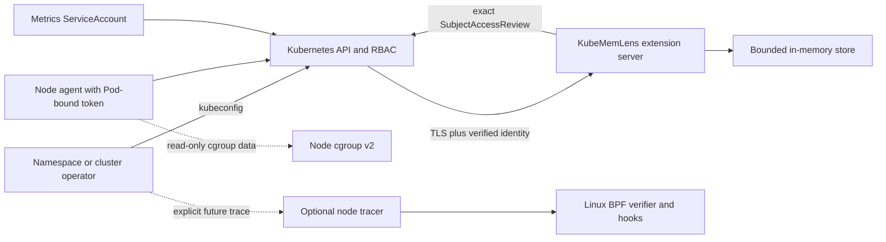

# KubeMemLens threat model

Date: 25 August 2026
Status: v1 design review; the authenticated API and optional eBPF tracer are not implemented

## Executive summary

KubeMemLens reads node cgroup v2 data, maps it to Kubernetes identities and serves bounded in-memory diagnostics. The current alpha limits network reachability but does not authenticate agent writes or authorise reads by tenant. It is therefore not suitable for a shared multi-tenant cluster.

The accepted v1 design makes the Kubernetes API server the only production entry point. It uses an aggregated API, exact delegated `SubjectAccessReview` decisions, Pod-bound node-agent identity and collector epochs for replay resistance. Direct collector routes close in the secure profile. This design is recorded in [ADR 0004](../adr/0004-use-kubernetes-aggregation-for-authentication.md) and the [endpoint policy](authentication-and-authorisation.md).

Optional eBPF tracing remains a separate later boundary. A compromised tracer could observe neighbouring tenants, consume kernel resources or turn excessive privilege into node compromise. It must be installed separately, admit one authorised target at a time, load only an approved programme and tear down automatically.

The leading risks are cross-tenant reads, forged or replayed agent writes, trust of spoofed aggregation headers, collector compromise, unsafe tracer privilege, sensitive diagnostic disclosure and unbounded node work.

## Scope and assumptions

In scope:

- `kubectl-memlens`, the standard agent, collector, Helm chart, release artefacts and proposed optional tracer.
- Operator reads, automation and metrics reads, agent writes, offline captures and the future trace stream.
- Kubernetes authentication, RBAC, aggregation proxy, delegated authorisation, ServiceAccount tokens and serving certificates.
- Cgroup data, Kubernetes metadata, in-memory history, metrics, logs and terminal output.
- Shared clusters where namespace users are not mutually trusted.
- GKE, EKS, AKS and self-managed Linux node pools.

Out of scope:

- A Kubernetes control plane or cloud identity provider already controlled by an attacker.
- A host-root attacker on a worker node. Such an attacker can already alter workloads and observations.
- Hosted KubeMemLens control planes and external identity providers.
- Language-native profilers launched inside application containers.

Confirmed product decisions:

- Shared multi-tenancy is mandatory for v1. The alpha does not claim it.
- The v1 secure path uses Kubernetes-native authentication and posts node data into the collector.
- Deep mode reaches v1 before a restricted mode is shipped.
- Identifiable workload and PVC names may appear in authorised interactive output. They remain excluded from default metrics, logs and redacted captures.
- Raw process and file paths require an explicit trace action and must not enter default captures, metrics, logs or persistent storage.

Assumptions requiring implementation or provider validation:

- The aggregation layer is enabled and the control plane can reach the extension Service over TLS.
- The aggregation request-header ConfigMap and allowed proxy client names are correctly configured.
- Pod-bound ServiceAccount identity includes Pod UID, node name and node UID claims on supported provider profiles.
- A NetworkPolicy-capable CNI is available as defence in depth. NetworkPolicy is not an authorisation decision.
- A cluster administrator, not a namespace user, installs the optional tracer profile.
- Tracer node pools expose approved kernel hooks and BTF data.

## System model

### Primary components

- CLI and TUI: use the caller's kubeconfig and render only data returned by the authorised API (`cmd/kubectl-memlens`, `internal/client`, `internal/tui`).
- Standard agent: capability-free DaemonSet with read-only cgroup access and Kubernetes metadata reads (`cmd/memlens-agent`, `internal/agent/scanner.go`, `charts/kube-memlens/templates/daemonset.yaml`).
- Collector and future extension server: validate bounded snapshots and hold current data plus recent Pod history in memory (`internal/collector/server.go`, `internal/collector/store.go`).
- Kubernetes API server: authenticates clients, applies RBAC and proxies aggregated requests with verified identity.
- Certificate bootstrap job: proposed short-lived Helm hook that updates one Helm-created serving Secret and one `APIService`.
- Optional tracer: proposed per-node loader and event reader, disabled by default.
- Linux kernel and cgroup filesystem: source of memory observations and future BPF events.

### Data flows and trust boundaries

1. An operator or automation account authenticates to the Kubernetes API server with its existing kubeconfig identity.
2. The API server applies RBAC and proxies an aggregated request over TLS with authenticated identity headers.
3. The extension server validates the aggregation proxy certificate and allowed name, delegates the exact request through `SubjectAccessReview`, then filters the store before lookup.
4. Each node agent uses a rotated Pod-bound token to read the collector epoch and create a snapshot through the Kubernetes API server.
5. The extension server binds the snapshot to authenticated Pod and node claims, epoch and sequence before decoding or mutating the store.
6. A metrics scraper receives only the cluster-scoped metrics resource. Offline replay reads a local capture and never contacts the cluster.
7. A future trace request is authorised for one immutable Pod/container target, routed to that node, filtered before event emission and destroyed on expiry or disconnect.

Trust boundaries are client to Kubernetes authentication, Kubernetes aggregation proxy to extension server, authenticated node agent to snapshot ingestion, collector to in-memory tenant data, container to node cgroup/kernel and future tracer to kernel events.

## Assets

| Asset | Security objective |
| --- | --- |
| Tenant diagnostic data | Return Pod, container, workload, history and volume data only within the caller's authorised namespace or cluster scope. |
| Node identity and snapshots | Accept a snapshot only from the live agent Pod bound to that node, in order and for the current collector process. |
| Kubernetes credentials | Never store or log kubeconfig output, bearer tokens, projected tokens, proxy certificates or raw group lists. |
| Collector integrity | Prevent unauthorised mutation, stale replay, cross-node claims and unbounded store growth. |
| Node integrity | Keep the standard agent capability-free and prevent the optional tracer from loading arbitrary programmes or gaining broad host access. |
| Diagnostic confidentiality | Keep UIDs, cgroup paths, process/file paths and denied object names out of default telemetry and captures. |
| Availability | Bound request bodies, response sizes, store records, trace work, certificate failure and delegated-authorisation latency. |
| Evidence integrity | Mark stale, partial, unsupported, truncated or event-loss states rather than presenting them as clean evidence. |
| Supply-chain integrity | Publish matched, signed and reproducible images and any future BPF objects with provenance. |

## Attacker model

Capabilities:

- A namespace user can make crafted API requests and run high-memory or high-event workloads in their namespace.
- An in-cluster workload can attempt to reach collector or agent listeners directly and can forge HTTP identity headers.
- A compromised application container can manipulate its own cgroup activity, processes, paths and lifecycle.
- A stolen live agent token can be replayed during its validity window.
- A compromised collector can read its in-memory diagnostics and use every permission granted to its ServiceAccount.
- A compromised future tracer can exercise every capability, host mount, programme and API permission granted to it.
- A malicious contributor can attempt to add unsafe code, manifests or release artefacts.

Non-capabilities at the start of an abuse path:

- The attacker cannot administer Kubernetes, alter RBAC or aggregation configuration, control the host kernel or forge a valid proxy client certificate.
- A namespace user cannot install the optional tracer or upload BPF bytecode through KubeMemLens.
- The attacker cannot bypass an uncompromised Kubernetes authenticator and authoriser.

## Entry points

| Entry point | Untrusted input | Boundary and owner |
| --- | --- | --- |
| Aggregated read resources | Verb, namespace, resource, name, selectors and pagination | Kubernetes authentication plus extension delegated authorisation; future PROD-004 handlers |
| `nodesnapshots` create | Identity extras, epoch, sequence, time and bounded snapshot JSON | Kubernetes authentication plus extension node binding; future PROD-003 handler and `internal/collector` validation |
| `ingestionepochs` get | Agent identity | Exact agent RBAC and extension identity check |
| Aggregation listener | TLS client certificate and forwarded identity headers | Request-header authenticator configured from `extension-apiserver-authentication` |
| Serving certificate bootstrap | Secret and `APIService` names, CA bundle and expiry | Proposed name-scoped update permissions for Helm-created objects |
| Alpha `/api/v1/*` and `/metrics` | HTTP path, query and bodies | Current `internal/collector/server.go`; disabled in the v1 secure profile |
| CLI and TUI | Flags, selectors, capture paths and local terminal | `cmd/kubectl-memlens`, `internal/client`, `internal/tui`, `internal/incident` |
| Cgroup scanner | Host cgroup files and container identifiers | `internal/cgroup`, `internal/agent/scanner.go` and read-only host mount |
| Future trace admission and stream | Target identity, duration, raw-path choice and cancellation | Future admission service and node tracer |
| Release inputs | Go modules, images, Helm templates and future BPF objects | CI, release workflow and signature/provenance policy |

## Top abuse paths

1. A namespace user requests an all-namespace list or changes a target after authorisation to read another tenant's diagnostics.
2. An in-cluster caller connects directly to the extension listener and supplies `X-Remote-User` or node extras without the aggregation proxy certificate.
3. A stolen agent request changes the payload node or replays an accepted sequence after a collector restart.
4. An authorisation timeout, malformed identity or API outage accidentally opens a legacy direct route or returns store data.
5. A collector compromise uses broad Kubernetes permissions to enumerate cluster data or leaks stored identifiers through audit output.
6. A metrics scrape, capture, log or error exposes names, UIDs, paths, tokens or a denied object's existence.
7. A compromised tracer uses excessive capability, arbitrary bytecode, writable host mounts or stale attachments to affect the node.
8. A high-volume workload exhausts collector memory, response encoding, trace ring buffers or node CPU.
9. A substituted image or BPF object bypasses reviewed bounds while retaining a trusted release name.
10. Unsupported provider or kernel behaviour produces incomplete observations that users treat as absence of a memory problem.

## Threat model table

Existing eBPF threat IDs TM-001 through TM-010 retain their original meanings. Authentication and authorisation threats start at TM-011.

| ID | Threat | Preconditions | Impact | Required controls | Verification evidence |
| --- | --- | --- | --- | --- | --- |
| TM-001 | Cross-tenant trace target substitution | User can request a trace | High confidentiality breach | Authorise namespace and Pod UID; resolve node/cgroup server-side; bind an immutable target; filter before emission | Two-namespace adversarial trace test |
| TM-002 | Node takeover through tracer privilege | Tracer Pod is compromised | Critical cluster impact | Never use privileged mode or `CAP_SYS_ADMIN`; prefer reviewed `CAP_BPF` and `CAP_PERFMON`; minimal read-only mounts and dedicated account | Manifest policy tests and external escape review |
| TM-003 | Arbitrary BPF programme loading | Loader accepts bytecode or attach points from input | Critical kernel risk | Embed an allowlisted object; fixed attach points; no upload API; verify release identity | Negative loader tests and provenance verification |
| TM-004 | Sensitive trace path disclosure | Raw-path trace is enabled | High tenant or privacy impact | In-kernel target filter; explicit action and warning; ephemeral output only; redact logs, metrics and captures | Golden output tests and multi-tenant trace test |
| TM-005 | Trace resource exhaustion | Target creates high event volume | High node availability impact | Hard duration, event, byte, map, CPU and concurrency caps; sampling and loss counter | Stress benchmark and resource-limit test |
| TM-006 | Orphaned trace attachment | Cancellation, expiry or restart races | High persistent node overhead | Link-owned lifecycle, expiry watchdog, bounded cleanup of KubeMemLens objects, no persistent pins by default | Kill, restart, disconnect and expiry tests |
| TM-007 | Ambiguous trace result | Event loss or Pod replacement occurs | Medium integrity impact | Bind Pod UID and container start; expose loss/truncation; stop on replacement | Churn and loss tests |
| TM-008 | Supply-chain substitution | Build or release pipeline is compromised | Critical fleet impact | Reproducible build, checksum, SBOM, provenance, signature and loader/object version match | Release artefact and signature policy test |
| TM-009 | Tracer network or API bypass | In-cluster attacker reaches tracer | High cross-tenant impact | Kubernetes authentication; no unauthenticated node port; NetworkPolicy as defence in depth; bounded decoding | Unauthorised network and fuzz tests |
| TM-010 | Provider or kernel incompatibility | Required BTF, hook or permission is absent | Medium availability or integrity impact | Per-node preflight; supported-state matrix; fail without attachment; retain deep-mode diagnosis | GKE, EKS, AKS and unsupported-node fixtures |
| TM-011 | Unauthenticated or forged snapshot ingestion | Caller reaches the write listener | High diagnostic integrity breach | Production writes only through aggregated API; exact agent ServiceAccount; delegated SAR; direct listener disabled | Direct-connect, forged-header and wrong-account tests |
| TM-012 | Cross-tenant list, detail or history read | Namespace principal has some read permission | High confidentiality breach | Namespaced virtual resources; exact namespace SAR; filter before lookup; cluster list requires ClusterRole | Two-namespace list, get, watch, history, compare and capture tests |
| TM-013 | Aggregation identity-header spoofing | Caller reaches extension Service directly | Critical authentication bypass | Validate proxy client CA and allowed name before trusting headers; use upstream delegated authenticator; reject direct requests | Direct TLS/plaintext and forged-header tests |
| TM-014 | Stolen token or cross-node snapshot claim | Live agent token is copied | High integrity and tenant impact | Pod-bound rotated token; require Pod UID, node name and node UID extras; payload must match; delete Pod to revoke | TokenReview claim, wrong-node, deleted-Pod and expiry tests |
| TM-015 | Snapshot replay or reordering | An accepted request is captured | High diagnostic integrity impact | Random collector epoch; strictly increasing sequence per authenticated Pod UID; bounded capture time | Duplicate, lower sequence, stale time and restart replay tests |
| TM-016 | Authentication or authorisation failure opens access | API server, SAR or config is unavailable | Critical tenant boundary failure | Deny no-opinion, timeout, malformed and transport errors; readiness fails; no legacy fallback | Fault injection for API, ConfigMap, TLS and SAR failures |
| TM-017 | Credential or tenant metadata disclosure | Logs, metrics, errors or captures are accessible | High confidentiality impact | Bounded reason codes; no tokens, raw groups, UIDs, paths or denied names; low-cardinality labels; `0600` redacted captures | Log/metric/capture golden tests and secret scans |
| TM-018 | Collector compromise becomes Kubernetes compromise | Collector process is controlled | Critical cluster impact | Only auth-delegator and authentication ConfigMap read; no Pod, Node, Secret or workload read; projected token; separate bootstrap account | Rendered RBAC audit and stolen-token adversarial test |
| TM-019 | Confused-deputy authorisation mismatch | Route and SAR attributes differ | High cross-tenant impact | Construct exact verb, group, resource, subresource, namespace and name from parsed route; decide before store access | Table-driven route/SAR parity tests |
| TM-020 | Certificate bootstrap or rotation widens trust | Hook account or stale CA is abused | High authentication or availability impact | Name-scoped temporary RBAC; atomic Secret/APIService update; expiry alert; hook cleanup; tested rollback | Install, rotate, rollback and uninstall tests |
| TM-021 | Workload metrics bypass read policy | Scraper reaches legacy `/metrics` | High confidentiality impact | Authenticated cluster-scoped metrics resource; dedicated scraper Role; disable workload-labelled direct route | Direct-route denial and metrics-only RBAC tests |

## Criticality calibration

- Critical: enables node or cluster takeover, forges an authenticated principal, opens all tenant data or compromises a released fleet. Examples are trusting spoofed request headers, failing open when SAR is unavailable or loading arbitrary BPF bytecode.
- High: exposes one or more tenants, corrupts diagnostic evidence, materially degrades a node or leaves privileged state behind. Examples are cross-namespace history reads, cross-node snapshot claims or orphaned attachments.
- Medium: creates bounded diagnostic unavailability or clearly marked incomplete evidence without privilege escalation. Examples are unsupported BTF or a rejected request during certificate rotation.
- Low: affects local usability or non-sensitive presentation without crossing tenant, node, credential or evidence boundaries.

## Focus paths for security review

| Focus path | Why it matters | Primary evidence owner |
| --- | --- | --- |
| Aggregation proxy authentication | The extension must never trust caller-supplied identity headers | PROD-003 request authenticator and direct-connect tests |
| Route to SAR attribute parity | One namespace or subresource mismatch becomes a confused deputy | PROD-004 table-driven handler and policy tests |
| Agent node binding and replay | Node claims, epoch and sequence protect snapshot integrity | PROD-003 ingestion tests and kind feasibility harness |
| Secure-profile listener removal | A correct aggregated API is insufficient if legacy routes remain reachable | PROD-005 network and chart tests |
| Collector and bootstrap RBAC | Compromise impact depends on the exact rendered permissions | Helm render audit and install/upgrade/rollback tests |
| Store and response bounds | Shared-cluster attackers can create load inside authorised namespaces | `internal/collector` unit, fuzz and density tests |
| Logs, metrics and captures | Diagnostic identifiers must not escape their authorised path | `internal/metrics`, `internal/incident` and golden tests |
| Standard agent host boundary | The default chart must remain non-privileged and capability-free | `charts/kube-memlens/templates/daemonset.yaml` policy tests |
| Optional tracer admission and lifecycle | eBPF adds the strongest node trust boundary | Future admission, loader and external security review |
| Build and release integrity | A signed unsafe artefact affects every installed cluster | `.github/workflows/release.yml`, SBOM, provenance and signature checks |

## Quality check

- Every entry point maps to a threat or documented non-sensitive path.
- Every critical or high threat has a named prevention control and verification owner.
- NetworkPolicy is treated only as defence in depth.
- The current alpha limitation and future design are labelled separately.
- No credential, tenant identifier or sensitive runtime value is included in this document.

Design baselines include Kubernetes [aggregation-layer authentication](https://kubernetes.io/docs/tasks/extend-kubernetes/configure-aggregation-layer/), [authorisation and SubjectAccessReview](https://kubernetes.io/docs/reference/access-authn-authz/authorization/), [ServiceAccount token administration](https://kubernetes.io/docs/reference/access-authn-authz/service-accounts-admin/), Linux [BPF verifier](https://docs.kernel.org/bpf/verifier.html) and Kubernetes [RBAC good practices](https://kubernetes.io/docs/concepts/security/rbac-good-practices/). These mechanisms support the controls, but do not replace KubeMemLens route, payload, lifecycle and tenant-isolation tests.
